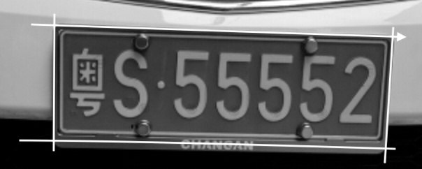

# 车牌检测与识别

16307130335           复旦大学计算机科学与技术          方煊杰

## 1 背景介绍

车牌检测与识别技术在当今社会中已经得到越来越广泛的运用。

无论是高速公路视频监控还是停车场智能管理、ETC收费系统，车牌检测识别都是不可或缺的重要部分。

事实上，我们生活中已经处处可见成熟的车牌识别技术，就连回家进入小区大门，或者随意一个地下车库，我们都能够看见竖立在横杆边上的检测显示屏。

但由于它的实用性和应用能力，让我对此十分感兴趣，并想着能否突破传统研究里在特定条件下的表现，在开放，复杂环境中也能够有着精准的识别，所以我的目的在于研究车载监控视频中车牌识别，希望能够借此实现车辆行驶过程中的车牌识别，减轻公安部门肉眼检测车牌压力。

在这次项目中，我同时使用了传统技术与深度学习方法，对这两种方法在不同地方的优劣也有了一定的认知。


## 2 具体实现

### 2.1 车牌简介

我国机动车辆号牌在尺寸，书写，格式上都有着明确的规定，这在一定程度上对于检测识别有着很大的帮助：

长度为44cm，宽度14cm，共由7个字符和一个分隔符“  **·**  ”组成，民用车牌上第一个字符为汉字，是省、直辖市、自治区的简称；第二字符是大写英文字母，代表地级行政区的字母代码；后面五位为数字和大写英文字母混合组成的牌号。同时为了避免混淆，大写字母 O 和 I 被弃之不用。

当然，车牌位置虽然都是固定于车辆保险杠左右，但由于不同车辆型号不同，位置高低也有区别，而车辆颜色特征等等更增加了大量无关背景内容，所以初始步骤的车牌检测其实是非常重要的。

而当今高速公路收费或者地下车库的车牌识别都是将拍摄图片锁定在车牌区域，因此能够很好的识别出来，但对于不同任意拍摄角度的汽车行驶视频，就无能为力了。


### 2.2 车牌检测与提取

车牌检测是整个车牌识别的基础，我所用的方法就是基于车牌边缘特征与颜色特征相结合的定位方法。

#### 2.2.1 边缘提取

```python
    src = cv.imread('test_img/test.jpg')
    kkk = src
    #cv.imshow('input_image', src)
    # 二值化
    img = cv.cvtColor(src, cv.COLOR_RGB2GRAY);
    cv.imwrite("ppt/grey.jpg", img)
    # 高斯滤波
    img_gaussian = cv.GaussianBlur(img, (5, 5), 0)
    cv.imwrite("ppt/gauss.jpg", img_gaussian)
    # 获取矩形自定义核
    element = cv.getStructuringElement(cv.MORPH_RECT, (3, 3))
    # 膨胀操作
    img_dilate = cv.dilate(img_gaussian, element)
    cv.imwrite("ppt/dilate.jpg", img_dilate)
    # 边缘提取
    img_canny = cv.Canny(img_dilate, 30, 120, 3)
    cv.imwrite("ppt/canny.jpg", img_canny)

```

传统OCR技术可以很好的运用到车牌边缘检测中：

* 二值化：对输入的彩色车牌图像进行灰度化，合理的灰度化将对图像信息的提取有很大帮助，也是后期边缘检测的基础。由于人眼对绿色的敏感最高，对蓝色敏感最低，因此，按下式对RGB三分量进行加权平均能得到较合理的灰度图像。
* 高斯滤波：选取高斯核进行降噪，试了3，5，7后发现5的效果最好
* 自定义矩形核：由于车牌是有规定形状的，所以我们可以考虑用矩形来对提取的边缘进行优化筛选
* 膨胀：膨胀时为了避免识别事信息区域轮廓没有闭合，从而导致漏提取信息区域轮廓，所以加入膨胀操作
* 提取：使用canny进行提取，之所以使用canny算子，是因为sobel算子对边缘定位不够准确，而laplacian算子容易丢失边缘信息造成矩阵不闭合，因此选择canny算子


#### 2.2.2 颜色定位

由于车辆图片内容丰富，十分复杂，因此并不能准确找出对应车牌区域，因此要根据车牌颜色来二次定位筛选。

* 将RGB转为HSV，由于HSV把明度作为单独的分量提取出来，应用在光照条件不好的照片中十分有效。
* 对颜色设置mask去除背景
* 进行形态学操作后，可以定位到对应的颜色区域，排除其他干扰。


### 2.2 锐化与增强

在得到了对应的车牌区域后，我们需要对车牌进行锐化与增强。

#### 2.2.1 透射变换

这个可以直接参考我期中的ppt，这里就不过多赘述，效果如下：





#### 2.2.2 锐化增强

```python
    img = cv.cvtColor(dst, cv.COLOR_RGB2GRAY);
    blockSize = 25;
    constValue = 10;
    img = cv.adaptiveThreshold(img, 255, cv.ADAPTIVE_THRESH_MEAN_C, cv.THRESH_BINARY, blockSize, constValue);

```


### 2.3 文本分割

接下来要做的就是文本分割，将车牌分成单个字符：

```python
# min_thresh: 阈值  min_range: 跨度
def split_pos(pos, min_thresh, min_range):
    split_res = []
    length = 0
    for i in range(len(pos)):
        if pos[i] > min_thresh:
            length += 1
        else:
            if length > min_range:
                split_res.append([i - length, i])
            length = 0
    if length != 0:
        split_res.append([len(pos) - length, len(pos)])
    return split_res
```

采用投影算法，将车牌分成单个的字符：


之后将生成得到的单个字符统一放缩到同样大小，方便后续识别处理。


### 2.4 文本识别

#### 2.4.1 SVM

* 对图片进行预处理，进行抗扭矩操作，再提取了HOG作为描述符。采用gramma=0.5的核，来训练二值化字符图片

* 二值化图片可以从网上下载也可以直接使用skleaner数字集训练，我这里采用的是自己生成，并且由于车牌规定了字体，所以训练集的量相对其他来说比较少。

  最终准确率结果如下：

  |        | 数字  | 字母  |
  | ------ | ----- | ----- |
  | 准确率 | %97.3 | %89.9 |

  训练完成后，svm的识别速度很快，不愧是应用广泛的传统识别方法。


#### 2.4.2 CNN

说起识别当然要使用CNN了，这里不赘述cnn的网络结构，但是CNN在训练时消耗时间较长，可能是卷积运算量大的原因，不过结束后识别效果高于SVM：

|        | 数字  | 字母  |
| ------ | ----- | ----- |
| 准确率 | %99.2 | %95.3 |



## 3 拓展端到端

传统的难点实质都不在最后的识别上，而是刚开始的分割提取，一旦有偏差，就会导致后续有极大可能识别出错。

### 3.1 生成模拟车牌

网上现在有何怒动车牌生成器，可以利用其生成大量车牌：

* 随机生成7位字符（按照中国车牌规则）
* 再将空白车牌上插入字符
* 添加背景
* 添加噪声，即将车牌做扭曲拉伸，代表不同拍摄角度。


### 3.2 多分类识别

直接进行多标签分类，基于GRU的神经网络。由三层CNN+两层GRU组成：

```python
class CNN(nn.Module):
    def __init__(self):
        super(CNN, self).__init__()
        self.conv1 = nn.Sequential(         # input shape (1, 28, 28)
            nn.Conv2d(
                in_channels=1,              # input height
                out_channels=16,            # n_filters
                kernel_size=5,              # filter size
                stride=1,                   # filter movement/step
                padding=2,                  # if want same width and length of this image after con2d, padding=(kernel_size-1)/2 if stride=1
            ),                              # output shape (16, 28, 28)
            nn.ReLU(),                      # activation
            nn.MaxPool2d(kernel_size=2),    # choose max value in 2x2 area, output shape (16, 14, 14)
        )
        self.conv2 = nn.Sequential(         # input shape (16, 14, 14)
            nn.Conv2d(16, 32, 5, 1, 2),     # output shape (32, 14, 14)
            nn.ReLU(),                      # activation
            nn.MaxPool2d(2),                # output shape (32, 7, 7)
        )
        self.out = nn.Linear(32 * 7 * 7, 94)   # fully connected layer, output 10 classes

```


### 3.3 实验结果

|              | 准确率 |
| ------------ | ------ |
| CNN+GRU+LSTM | 90.1%  |


## 4 总结

很显然，传统方法的优缺点十分明显，在于对特定环境的要求较高，容错低，但是应用广泛，可以快速投入生产。

而端到端则需要大量的时间训练学习，不能快速落实到应用。

由于个人能力有限，本次project还有很多遗憾与缺陷：

* 当车与背景整体颜色接近时无法有效定位车牌
* 训练样本过少，不能够达到自己预期的效果
* 监控视频条件下像素低下也影响到了识别与检测

不过，能够自己从零实现生活中的应用还是让自己觉得收获不少，也感谢这门课传达的一些学习精神与学习方法。

也许还没有创新，但我们会在复刻中，一步步摸索到自己创新的道路。